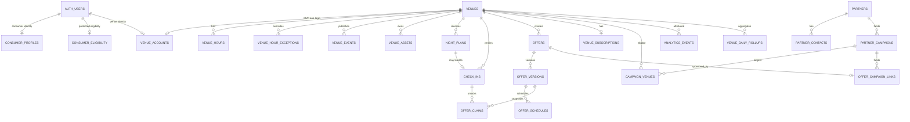

# Outly database blueprint

**Status:** Product and data requirements, version 1  
**Last reviewed:** July 19, 2026  
**Implementation status:** The local Supabase foundation, venue domain, nightlife plans, verified check-ins, offer claims, and founder-managed partner campaign contracts are implemented with structural, workflow, and RLS security tests. Billing, aggregate analytics, and production API adapters remain design-only. Raw location evidence is intentionally not implemented. Nothing has been deployed to the hosted Supabase project.

This document is the agreed source of truth for the Outly MVP backend. It is deliberately implementation-ready without being SQL: it defines what the database must represent, which rules the server must enforce, who can access each class of data, and what remains a product decision.

## 1. Locked product decisions

- The iOS app is for consumers only.
- Venues use a separate web dashboard. There are no venue-management screens in the iOS app.
- Each venue has one business-email-and-password login for the MVP. There are no owner, manager, or staff roles yet.
- Venues can self-register, but a founder must approve a venue before it is published.
- Consumers can authenticate with Apple, Google, Meta, or email. Authentication identities belong to Supabase Auth.
- Consumer onboarding requires first name, date of birth, and gender.
- Gender choices are `Man`, `Woman`, and `Another gender`. Internally these are `man`, `woman`, and `other`.
- The backend enforces a 19+ account requirement from a self-reported date of birth. Outly is not performing identity or ID verification.
- Date of birth and age-eligibility status cannot be edited by the consumer in the app. Corrections require support.
- A consumer can have one active plan per nightlife date. A plan can be cancelled or replaced.
- A nightlife date ends at 4:00 AM in the venue's time zone. For example, 1:30 AM Saturday in Toronto belongs to Friday night.
- “Going” is derived from plans and verified check-ins. It is never stored as a mutable venue count.
- Check-in is initiated by the user and uses iOS Precise Location with When In Use authorization.
- The server, not the phone, makes the authoritative geofence decision.
- A venue's default check-in radius is 75 metres and is configurable.
- There is no QR code and no venue-staff action in the MVP. An eligible offer is unlocked after a verified check-in and is displayed on the consumer's phone for a server-configured positive duration or as an open-ended claim while the venue presence remains active.
- Venues can create offers, but every venue-created offer requires founder approval during the pilot.
- Partner campaigns and their commercial terms are entered and managed by founders. Partners do not have accounts or a dashboard in the MVP.
- Consumer and venue accounts can both be permanently deleted from their respective products.

## 2. Scope and non-goals

### MVP scope

- Consumer authentication and onboarding
- Published venue discovery and venue detail
- Venue registration, approval, profile management, hours, events, and media
- One active consumer plan per nightlife date
- Server-verified venue check-in
- Venue-funded and partner-funded offers
- Timed or open-ended offer claims shown to staff
- Venue subscription and entitlement state synchronized from Stripe
- Venue analytics for discovery, plans, check-ins, and offers
- Founder moderation of venues, offers, and campaigns
- Account deletion and privacy-safe retention

### Explicit non-goals

- Venue roles, team invites, or staff accounts
- Partner accounts or a partner dashboard
- QR scanning or staff-side offer redemption
- A claim that a bartender actually applied a discount
- Consumer background-location tracking
- Real-time departure detection or post-departure notifications
- ID-document validation
- Arbitrary remote HTML or remotely configurable UI in the iOS app
- A speculative consumer-facing “peak time” feature

## 3. Architecture and trust boundaries

Outly should use Supabase Auth, Postgres, PostGIS, and Storage. Stripe remains the billing source of truth. Server-side workflows may be implemented later with Edge Functions, database functions, or a small application API, but the same trust boundaries apply whichever option is chosen.

### Database schemas

| Boundary | Purpose | Client access |
| --- | --- | --- |
| `auth` | Supabase-managed users, identities, and sessions | Through Supabase Auth only |
| `public` | Client-addressable operational records with explicit grants and RLS | Only the minimum tables, rows, and operations each client needs |
| `private` | DOB, eligibility, business legal data, billing IDs, commercial campaign terms, raw location evidence, moderation notes, and internal audit data | Server and founders only; never an exposed Data API schema |
| `storage` | Venue and partner media objects | Bucket policies; public/signed delivery only after approval |

The project already uses opt-in Data API exposure. Every client-accessible object must receive an explicit grant and RLS policy. An authenticated role by itself is not authorization: ownership or publication predicates are required.

### Authoritative server operations

Clients must not directly set protected state. The following operations require a server-controlled transaction or narrowly scoped RPC/API endpoint:

- Complete consumer onboarding and calculate 19+ eligibility
- Submit, approve, reject, suspend, or delete a venue
- Publish critical venue-profile changes
- Create, replace, or cancel a nightlife plan
- Verify a location sample and award a check-in
- Test offer eligibility, consume availability, and create an offer claim
- Approve or publish an offer or campaign
- Apply Stripe webhook state and derive venue entitlements
- Return venue analytics with privacy suppression
- Delete a consumer or venue account

The iOS app and browser receive only a publishable Supabase key. A secret or service-role key must never be shipped to either client.

## 4. Relationship map

## 5. Naming, identifiers, and time rules

- Table and column names use lowercase `snake_case`.
- Supabase Auth user IDs remain UUIDs and are referenced only through `auth.users.id`.
- Publicly exposed venue, offer, campaign, and claim identifiers use opaque UUIDs.
- High-volume internal append-only events may use generated `bigint` identities.
- All instants use timezone-aware timestamps. User-supplied device timestamps are evidence, never the authoritative creation or expiry time.
- Calendar dates use a date type. Local opening/cutoff times use local time plus an IANA time-zone name such as `America/Toronto`.
- Money uses an exact decimal amount plus an ISO currency code. Floating-point types are not used for money.
- Statuses and categories use constrained values rather than unrestricted strings.
- Every foreign-key column that participates in joins, deletion, RLS, or common filters receives an index.
- Geography uses a PostGIS point with longitude first and latitude second, plus a GiST spatial index.
- Public records use `created_at` and `updated_at`; reviewable or deletable records also use the relevant submitted, approved, suspended, archived, or deleted timestamp.

## 6. Table catalogue

The catalogue is logical rather than SQL. “Server-written” means a client cannot directly set or alter the field even if it can read the resulting record.

### 6.1 Consumers and authorization

#### `public.consumer_profiles`

One consumer profile per Supabase Auth user.

| Field | Requirement |
| --- | --- |
| `user_id` | Primary key and foreign key to `auth.users.id`; cascade on final Auth deletion |
| `first_name` | Required after onboarding; trimmed and length-limited |
| `onboarding_status` | `incomplete`, `complete`, or `blocked`; server-written |
| `account_status` | `active`, `deletion_pending`, `deleted`, or `suspended`; server-written |
| `onboarding_completed_at` | Server timestamp |
| `created_at`, `updated_at` | Server timestamps |

Consumers can read their own profile. Profile completion and protected fields go through the server workflow. Other consumers and venues cannot read it.

#### `private.consumer_eligibility`

Protected demographics and age eligibility. Keeping this outside the exposed schema prevents a broad profile query from returning DOB or gender.

| Field | Requirement |
| --- | --- |
| `user_id` | Primary key and foreign key to the consumer Auth user |
| `date_of_birth` | Required, self-reported, and not app-editable |
| `gender` | Required constrained value: `man`, `woman`, or `other` |
| `is_19_plus` | Server-calculated boolean; clients cannot write it |
| `age_eligibility_checked_at` | Time the server evaluated DOB |
| `age_eligibility_source` | MVP value `self_reported_dob` |
| `corrected_at`, `corrected_by` | Nullable support audit fields |

The server must reject onboarding when the user is under 19 on the evaluation date. Authorization must never rely on user-editable Auth metadata.

#### `private.internal_admins`

Founder/admin authorization allowlist.

| Field | Requirement |
| --- | --- |
| `user_id` | Unique Auth user ID |
| `role` | Initially `founder_admin`; extensible later |
| `active` | Server-controlled |
| `created_at`, `revoked_at` | Audit timestamps |

Founder authorization is stored server-side, not in `raw_user_meta_data`. If a JWT claim is added later, it must come from server-controlled app metadata and sensitive operations must tolerate claim-refresh delay.

#### `private.legal_acceptances`

Records terms/privacy/venue-agreement acceptance without overwriting prior versions.

Fields: subject Auth user, subject type (`consumer` or `venue`), document type, document version, accepted timestamp, and a limited audit source. Avoid retaining raw IP addresses longer than a documented fraud/legal need.

#### `private.device_push_tokens`

Consumer push tokens, platform/environment, last-seen time, and disabled time. Delete all tokens during consumer deletion. This table is ready for notifications but does not authorize background location collection.

#### `private.account_deletion_requests`

Durable workflow record for consumer and venue deletion requests: subject type and ID, requested/confirmed/started/completed timestamps, state, failure reason, and internal retention basis. It must not retain deleted profile content.

### 6.2 Venues

#### `public.venues`

Current approved public venue record plus publication state.

| Field group | Requirement |
| --- | --- |
| Identity | `id`, unique `slug`, required `display_name` |
| Publication | `registration_status`, `publication_status`, `approved_at`, `suspended_at`, `archived_at` |
| Location | address lines, market code, neighbourhood, city, province, postal code, country code, PostGIS `location`, `geofence_radius_metres`, IANA `timezone` |
| Public contact | public phone, public email, website, Instagram |
| Presentation | current hero asset reference, current approved marker asset reference, standard/featured placement state |
| Metadata | `created_at`, `updated_at` |

Allowed registration states: `draft`, `pending_review`, `changes_requested`, `approved`, `rejected`, `suspended`, and `archived`.

Allowed publication states: `unpublished`, `published`, and `paused`.

Consumer reads require both `registration_status = approved` and `publication_status = published`. There is no stored going count, offer string, age distribution, gender distribution, distance from the consumer, venue category subtitle, or peak time.

#### `public.venue_accounts`

Maps the single MVP venue login to one venue.

| Field | Requirement |
| --- | --- |
| `auth_user_id` | Unique Auth user ID; one venue account per login |
| `venue_id` | Unique venue ID; one login per venue in the MVP |
| `account_status` | `draft`, `active`, `suspended`, `deletion_pending`, or `deleted` |
| `last_login_at` | Server-observed, optional |
| `created_at`, `updated_at` | Server timestamps |

The password and canonical login email remain solely in Supabase Auth. This one-to-one mapping can later migrate to a venue-membership junction without changing venue IDs or venue-owned data.

#### `private.venue_business_details`

Private registration, billing, and contact information.

Fields: venue ID, legal business name, legal address, primary contact name, role/title, business email, business phone, authority-to-represent affirmation, agreement version, and review notes. Consumers never receive this row.

#### `public.venue_profile_revisions`

Pending critical changes while the last approved profile remains live. Structured revision fields mirror the reviewable venue fields rather than replacing the live record prematurely.

Critical changes requiring founder approval:

- Legal or public venue name
- Street address or PostGIS location
- Ownership/authority information
- Custom map marker artwork

Routine public phone, website, Instagram, and hours updates may publish immediately for an approved venue. Every change is audited.

#### `public.venue_hours`

Normalized recurring weekly hours.

Fields: venue ID, weekday, interval number, opens-at local time, closes-at local time, and closed flag. It supports two intervals in a day and closing after midnight. Display copy such as “Open until 2:00 AM” is derived, not stored.

#### `public.venue_hour_exceptions`

Date-specific closure or special hours. Fields: venue ID, local date, closed flag, optional open/close times, and short public note. Exceptions override recurring hours.

#### `public.venue_events`

Venue events displayed in the app and dashboard.

Fields: venue ID, title, short description, starts/ends timestamps, optional image asset, optional external URL, status (`draft`, `published`, `cancelled`, `ended`), and timestamps. An approved venue can publish ordinary event updates without founder approval; founders can unpublish abusive or misleading content.

#### `public.venue_assets`

Metadata for approved media stored in Supabase Storage.

Fields: venue ID, asset kind (`hero`, `gallery`, or `marker`), private-submission or public-approved storage path, alt text, moderation status, uploaded-by user, paid-entitlement requirement, dimensions, and timestamps. The venue's current hero and marker references are authoritative, and same-venue foreign keys prevent cross-venue media selection. Consumers receive only approved media belonging to approved, published venues. A custom marker requires both an active entitlement and approved media.

#### `private.venue_reviews`

Founder review history for registrations, critical revisions, suspensions, and reinstatements. Fields: venue/revision, decision, founder, public-facing response, private note, and timestamps.

### 6.3 Plans and verified attendance

#### `public.night_plans`

One record per plan attempt/version, preserving cancellation and replacement history.

| Field | Requirement |
| --- | --- |
| `id` | Opaque ID |
| `user_id` | Consumer Auth user; nullable only after account anonymization |
| `venue_id` | Planned venue |
| `nightlife_date` | Derived under the 4:00 AM venue-local boundary |
| `status` | `planned`, `cancelled`, `replaced`, `checked_in`, or `expired` |
| `request_idempotency_key` | Server-operation key preventing retry duplicates |
| `replaces_plan_id` | Optional link to the prior plan |
| `created_at`, `updated_at`, `cancelled_at`, `replaced_at`, `checked_in_at`, `expired_at` | Server timestamps |

A partial unique constraint permits only one `planned` or `checked_in` row for a user and nightlife date in the MVP. Cancelled, replaced, and expired history does not block a new plan. When multi-stop nights are introduced, this constraint can be narrowed to `planned` rows so a completed check-in no longer blocks the next plan; no table redesign is required.

“Going tonight” is the distinct count of consumers with a `planned` or `checked_in` plan for that nightlife date, combined without double-counting users who have a verified check-in.

#### `public.check_ins`

Authoritative check-in result and durable derived evidence.

| Field group | Requirement |
| --- | --- |
| Identity | ID, consumer ID, venue ID, optional plan ID, nightlife date |
| Timing | client capture time, server request time, server verification time |
| Quality | horizontal accuracy metres, location age seconds, precise/reduced accuracy state, authorization state |
| Decision | distance from venue metres, configured radius metres, outcome, rejection reason |
| Integrity | idempotency key, verifier version, created timestamp |

Outcomes include `verified` and `rejected`. Rejection reasons include permission denied, reduced or insufficient accuracy, stale sample, outside geofence, ambiguous nearest venue, venue unavailable, account ineligible, and rate limited.

The durable check-in row does not need raw latitude or longitude after verification. It retains only the derived distance and verification evidence needed for analytics, debugging, and fraud review.

The initial rapid-attempt rule allows five server-received attempts in five minutes per consumer. The threshold is stored in private server configuration and can be tuned without changing the schema. Each check-in snapshots the exact thresholds and verifier version used for its decision.

#### `private.check_in_location_evidence`

Optional short-lived raw sample for resolving a failed verification or fraud dispute. Fields: check-in request ID, encrypted/restricted latitude and longitude, captured time, horizontal accuracy, and automatic purge time. The default design is to discard raw coordinates immediately; if this evidence table is enabled, its short retention period must be approved before launch.

### 6.4 Offers

#### `public.offers`

Stable offer identity and ownership.

Fields: venue ID, creator type (`venue` or `outly`), lifecycle status, current approved version ID, paused reason, archived time, and timestamps.

Lifecycle: `draft` → `pending_review` → `changes_requested` or `rejected` → `approved` → `scheduled` → `live` → `ended`. An approved/scheduled/live offer can also be `paused` or `archived`.

#### `public.offer_versions`

Immutable snapshot of the terms and branding presented to a consumer. A material edit creates a new version and returns that version to review; it does not change existing claims.

| Field group | Requirement |
| --- | --- |
| Copy | public title/reward, one short explanation, staff-facing wording, fine print |
| Eligibility | minimum age, eligibility mode, plan/check-in requirements and cutoffs |
| Claim | claim duration seconds, per-user limit, total limit |
| Branding | funding source, sponsor display name, approved logo asset, disclosure copy, presentation-template ID |
| Moderation | version number, approval state, submitted/approved by and timestamps |

Supported MVP eligibility modes:

1. Any verified check-in
2. Check in during a defined time window
3. Check in before a cutoff
4. Make a plan before a cutoff, then complete a verified check-in

Material changes include the reward, eligibility rule, schedule, claim limit, legal terms, or sponsored branding. Copy-only typo correction can be handled as a founder-audited non-material amendment if it does not change meaning.

#### `public.offer_schedules`

One or more valid date/time rules for an offer version: venue-local start/end dates, eligible weekdays, optional daily start/end, check-in cutoff, plan cutoff, and per-occurrence capacity. Schedules that cross midnight use the venue nightlife date.

#### `private.offer_reviews`

Founder review decision, requested changes, private note, reviewer, and timestamps for each version.

#### `private.offer_campaign_links`

Optional one-to-one link between an offer and its founder-managed partner campaign. Keeping the campaign ID out of the exposed offer row prevents unpublished campaign relationships from leaking through otherwise public offer queries.

#### `public.offer_claims`

The location-verified entitlement created by the server.

| Field | Requirement |
| --- | --- |
| `id` | Opaque claim ID; no QR requirement |
| `user_id` | Consumer; nullable only after deletion/anonymization |
| `venue_id` | Venue where the claim is valid |
| `offer_id`, `offer_version_id` | Exact approved offer snapshot |
| `check_in_id` | Required verified check-in |
| `unlocked_at`, `expires_at` | Server-controlled timestamps; every entitlement expires, while a nullable offer duration determines whether the consumer sees a countdown |
| `status` | `active`, `expired`, or `voided` |
| `staff_reference` | Short non-secret display reference if later useful |
| `created_at` | Server timestamp |

Creating a claim must atomically recheck approval, schedule, venue/campaign status, user eligibility, per-user limit, and remaining capacity. The operation must be idempotent so retries cannot issue multiple claims.

The correct dashboard language is **offers unlocked** or **claims**, not redeemed offers or discounts applied. The MVP has no staff confirmation and therefore cannot prove redemption.

### 6.5 Partners and founder-managed campaigns

All tables in this section live in `private` unless a sanitized, approved projection is explicitly returned with an offer.

#### `private.partners`

Partner brand name, legal name, status, website, industry, approved logo asset, internal notes, billing address, and timestamps.

#### `private.partner_contacts`

Partner ID, contact name, role, email, phone, primary-contact flag, and timestamps.

#### `private.partner_campaigns`

| Field group | Requirement |
| --- | --- |
| Identity | partner, internal name, campaign status, approval status |
| Public | sponsor wording, public reward, approved disclosure, public terms, approved creative references |
| Eligibility | start/end, market/neighbourhood rules, age restriction, claim cap, per-user limit |
| Commercial | budget, compensation model, private deal terms, contract reference, reporting requirements |
| Audit | founder creator/approver, created/updated/approved timestamps |

Campaign lifecycle: `draft`, `pending_approval`, `approved`, `scheduled`, `live`, `paused`, `ended`, `rejected`, or `cancelled`.

#### `private.campaign_venues`

Many-to-many eligible venue list with optional venue-specific dates, inventory, and commercial overrides. A campaign may target a market or neighbourhood broadly, but eligible approved venues must still be resolvable before the campaign is displayed.

A partner campaign sponsors the normal offer/version/claim model through `offer_campaign_links`. It is not a separate consumer redemption system. Offer versions snapshot the approved public partner name, logo, disclosure, and terms so live claims do not change when a campaign record is edited.

### 6.6 Billing and venue entitlements

#### `private.billing_plans`

Plan code, public display name, active state, Stripe price ID, billing interval, and timestamps. Stripe product/price data is referenced, not reimplemented.

#### `private.plan_entitlements`

Configuration rows keyed by billing plan and entitlement key. This prevents product limits from being hardcoded in either client.

Initial entitlement keys:

- `active_offer_limit`
- `analytics_history_days`
- `advanced_demographics`
- `custom_map_marker`
- `featured_placement`
- `campaign_customization`
- `neighbourhood_benchmarks`
- `repeat_visitor_insights`
- `detailed_attribution`

#### `private.venue_subscriptions`

Venue ID, plan code, Stripe customer/subscription/price IDs, Stripe status, trial end, current-period end, cancel-at-period-end, cancelled time, and last-webhook time. Stripe webhooks are authoritative. Venue users cannot write subscription or entitlement state.

#### `private.stripe_webhook_events`

Stripe event ID, type, received/processed timestamps, processing status, and failure reason. The Stripe event ID is unique for idempotency. Retain the minimum payload needed for audit/debugging and avoid unnecessarily duplicating payment details.

### 6.7 Analytics and audit

#### `private.analytics_events`

Append-only interaction events for actions that are not already authoritative transactions, principally venue impressions and venue-detail views.

Fields: generated ID, nullable consumer ID, anonymous session ID, event name, venue ID, optional offer/campaign ID, nightlife date, server-received timestamp, client-occurrence timestamp, app version, and idempotency/deduplication key.

Plans, verified check-ins, and claims are counted from their own transactional tables, not duplicated as the source of truth in this stream.

The app submits events through a narrow ingestion operation with allowlisted names and server timestamps. Clients cannot insert into or select from this table directly, or arbitrarily attach another consumer ID.

#### `private.venue_daily_rollups`

Optional later optimization containing privacy-safe daily aggregates. It can be rebuilt from authoritative records and analytics events. Fields include venue/date plus impressions, detail viewers, plans, verified check-ins, offers unlocked, and unique returning visitors.

#### `private.venue_demographic_rollups`

Age and gender aggregates grouped at a privacy-safe venue/date or reporting-period level. Never expose underlying people. Suppress a cohort until the minimum sample threshold is met.

#### `private.audit_log`

Founder and sensitive server actions: actor, action, subject type/ID, reason, safe before/after summary, request correlation ID, and timestamp. Do not copy passwords, tokens, raw location, or entire private records into audit JSON.

## 7. Core invariants and constraints

These rules belong in database constraints and/or atomic server workflows, not only in UI validation.

### Account eligibility

- A completed consumer account has a DOB, one allowed gender value, and server-calculated `is_19_plus = true`.
- Protected eligibility cannot be written through ordinary consumer RLS.
- Suspended, deleted, incomplete, or underage accounts cannot create plans, check in, claim offers, or receive partner campaigns.
- Campaign and offer eligibility reads the protected `is_19_plus` result; it does not recalculate DOB on every display request.

### Venue publication

- A consumer-visible venue is both founder-approved and published.
- A suspended/archived venue cannot publish events, receive plans/check-ins, or run offers.
- Default geofence radius is 75 metres and must stay inside an administratively defined safe range.
- Paid placement or a custom marker requires an active entitlement and, for media, approval.

### Nightlife plans

- `nightlife_date = local date of (event time minus 4 hours)` using the venue's IANA time zone.
- At most one `planned` or `checked_in` record exists per user/nightlife date in the MVP.
- Replacement is transactional: the old plan becomes `replaced` and the new plan becomes `planned` together.
- “Going” and Tonight's Crowd counts use unique people and never double-count a plan plus that person's check-in.

### Location verification

MVP server parity with the current prototype:

- Location sample age at verification: no more than 30 seconds
- Horizontal accuracy: 75 metres or better
- Distance from the requested venue: within its configured radius, default 75 metres
- If multiple participating venues overlap, the requested venue must be unambiguously nearest; current tie tolerance is 1 metre
- Venue must be approved, published, and eligible for check-in
- Decision, distance, accuracy, sample age, and verifier version are recorded
- Raw latitude/longitude are discarded after the decision unless a separately approved short retention policy enables location evidence

Location is requested only when the consumer taps check in. The app requests When In Use permission, not Always permission. Reduced accuracy should lead to a clear request for Precise Location rather than a false check-in failure.

### Offer/campaign display eligibility

The backend returns an offer or sponsored placement only when all of these are true:

- The user is authenticated and has an active, completed, 19+ profile
- The venue is approved and published
- The offer and exact version are approved and live
- The date, weekday, and time match an active schedule
- Any selected market, neighbourhood, or eligible-venue rule matches
- A partner and partner campaign, if present, are active and approved
- Inventory remains and the user has not exceeded the applicable limit

These checks happen again when the user claims an offer. Showing an offer does not reserve inventory.

### Offer claims

- A claim always references a verified check-in and an immutable offer version.
- `expires_at` is based on server time.
- Repeated network requests with the same idempotency key return the same claim.
- Capacity and per-user limits are checked and consumed in one transaction to prevent oversubscription.
- A claim cannot become “redeemed” because the MVP has no staff verification.

## 8. Access-control matrix

| Data/action | Consumer app | Venue dashboard | Founder/server |
| --- | --- | --- | --- |
| Published venues, hours, events, approved media | Read | Read own/public | Full |
| Own consumer profile | Read limited public portion | None | Full as needed |
| DOB, gender, 19+ evidence | Submit through onboarding; no direct table access | Never | Restricted server/support |
| Plans | Read own; create/replace/cancel through authoritative operation | Aggregates only | Full |
| Check-in evidence | Read own result | Aggregates only | Restricted server/fraud support |
| Raw coordinates | Never after request submission | Never | Short-lived only if retention approved |
| Offer catalogue | Read sanitized eligible offers | Read/manage own drafts | Full and approve |
| Offer claims | Read own active/history-safe fields | Aggregate unlocked counts only | Full as needed |
| Venue public profile | Read | Read/write routine own fields; critical edits submitted | Full and approve |
| Venue legal/contact record | None | Read/update own through server | Full restricted |
| Partner and commercial campaign data | Sanitized approved branding only | Relevant public sponsor details only | Full restricted |
| Stripe IDs and webhook payloads | None | Subscription summary only | Full restricted |
| Analytics | None beyond consumer-facing crowd aggregate | Own venue aggregates with suppression | Full |
| Account deletion | Delete own consumer account | Delete own venue account | Execute/audit |

### RLS and grants baseline

- RLS is enabled on every table in an exposed schema.
- Grants are explicit and limited per table/operation.
- Policies specify the intended role and an ownership/publication predicate.
- `UPDATE` policies include both existing-row and new-row ownership checks and the required read policy.
- Columns used by RLS, particularly user and venue IDs, are indexed.
- Views exposed to clients use invoker security where supported; privileged views/functions stay outside exposed schemas.
- Any genuinely necessary privileged function has an empty fixed search path, performs its own caller/subject checks, lives outside exposed schemas, and has execution revoked from roles that do not need it.
- Founder status is never derived from user-editable metadata.
- Storage policies apply the same ownership and moderation boundaries as database records.

## 9. Analytics definitions

The dashboard should use explicit metric names and avoid implying more certainty than the product has.

| Metric | Definition |
| --- | --- |
| Venue impressions | Unique consumer/session views of a venue marker/listing within the selected period |
| Detail viewers | Unique consumers/sessions that opened the venue detail |
| Plans | Unique consumers whose plan became active for the venue/nightlife date |
| Check-in attempts | Server-received check-in verification requests |
| Verified check-ins | Unique consumers with a successful server verification at the venue/nightlife date |
| Offers unlocked | Unique successful claim creations, not staff-confirmed redemptions |
| Plan-to-check-in conversion | Verified planners divided by unique planners for the same eligible cohort |
| Offer unlock rate | Consumers unlocking the offer divided by eligible verified check-ins |
| Repeat visitor | A consumer with a prior verified check-in at the same venue within the configured reporting window |
| Attendance by hour | Verified check-ins grouped by venue-local hour |

Consumer-facing Tonight's Crowd uses current-night unique plans and verified check-ins. Age and gender distributions are aggregates only and are absent when the privacy threshold is not met. A small cohort must show “Not enough data,” not zero.

Historical busy-by-hour reporting belongs in the venue dashboard. The consumer app does not show a predicted or labelled peak time.

Venues never receive names, emails, Auth IDs, exact DOBs, individual genders, individual timelines, raw analytics events, or raw location samples.

## 10. Free and paid venue configuration

Limits live in `plan_entitlements` so they can change without a database redesign or app release.

| Capability | Free MVP direction | Paid MVP direction | Status |
| --- | --- | --- | --- |
| Public listing, contact, hours, events | Included | Included | Agreed |
| Basic offer creation | Included | Included | Agreed |
| Active offer limit | Suggested 1 | To decide | Open numeric limit |
| Analytics history | Suggested 30 days | Suggested 12 months | Open numeric limit |
| Basic plans/check-ins/claims analytics | Included | Included | Agreed |
| Advanced demographics and attribution | Not included | Included | Agreed direction |
| Custom approved map marker | Not included | Included | Agreed direction |
| Featured/promoted placement | Not included | Included | Agreed direction |
| Neighbourhood benchmarks | Not included | Included | Agreed direction |
| Repeat-visitor/retention insights | Not included | Included | Agreed direction |

Competitor and neighbourhood benchmarks must also meet privacy/cohort rules and must not expose another venue's identifiable confidential performance.

## 11. Account deletion and retention

### Consumer deletion

The iOS app must provide an in-app permanent deletion flow with confirmation and recent authentication where appropriate.

The deletion workflow must:

1. Mark the account deletion-pending and prevent new plans/check-ins/claims.
2. Revoke/sign out active sessions; deleting an Auth user alone does not immediately invalidate an already-issued JWT.
3. Cancel the active plan and void/expire active claims.
4. Delete push tokens and consumer-owned Storage objects before deleting the Auth user.
5. Delete first name, DOB, gender, age-eligibility record, provider identities, and other profile data.
6. Delete or anonymize user IDs on historical plans/check-ins/claims and remove detailed analytics events tied to the user.
7. Retain only non-identifying aggregate statistics under the approved retention policy.
8. Delete the Supabase Auth user and complete the deletion audit record.
9. Handle provider-specific revocation requirements, including Sign in with Apple.

Raw or precise location evidence is deleted immediately. Detailed venue/time records can still be identifying; deletion should roll them into privacy-safe aggregates or remove them rather than relying only on a null user ID.

### Venue deletion

The venue dashboard must provide a permanent business-account deletion flow.

The workflow must:

1. Suspend dashboard access and unpublish the venue.
2. End future events and offers and prevent new plans/check-ins.
3. Cancel future Stripe billing according to the displayed policy.
4. Delete the venue login, private contacts, and unnecessary media.
5. Retain invoices, contracts, charge/dispute evidence, and audit records only for the legally required period.
6. Preserve only a minimal archived venue identity where needed to keep consumer history, accounting, and anonymous aggregate analytics coherent.

A soft-delete flag alone is not account deletion. The implementation must remove or anonymize personal/business contact content according to the retention policy.

## 12. Current iOS model migration map

This records where the current prototype data will come from once the backend is connected.

| Current prototype field | Backend source |
| --- | --- |
| `Venue.name` | `venues.display_name` |
| `Venue.neighbourhood` | `venues.neighbourhood` |
| `Venue.hours` string | Derived from `venue_hours` plus `venue_hour_exceptions` |
| `Venue.address` | Structured `venues` address fields |
| Latitude/longitude | PostGIS `venues.location`, serialized safely for the app |
| `Venue.goingCount` | Derived current-night unique plans/check-ins |
| `Venue.offer` | Current eligible approved `offer_version`; never stored on venue |
| Age distribution | Privacy-safe current-night aggregate from eligible plans/check-ins |
| Gender mix | Privacy-safe current-night aggregate including `other` according to final display rules |
| Hardcoded venue artwork IDs | Approved `venue_assets` Storage paths |
| `UserProfile.age` | Replaced by protected `date_of_birth` plus server-calculated `is_19_plus` |
| Local `NightPlan.dateLabel` | Server-derived `nightlife_date` |
| Local ten-minute `TimedOfferWindow` | Server-controlled `offer_claims.unlocked_at` and `expires_at` |
| On-device geofence result | Server-controlled `check_ins` decision; the iOS result is only request evidence/UI state |

## 13. Required server workflows

### Complete onboarding

1. Require an authenticated user and validate first name, DOB, and gender.
2. Calculate age on the server using the current date and reject under-19 completion.
3. Write protected eligibility and mark onboarding complete in one transaction.
4. Return only the fields the client needs; do not echo protected internals unnecessarily.

### Register and approve a venue

1. Verify business email.
2. Create the draft venue/account/private business record.
3. Collect required profile, address, hours, public contact, media, authority affirmation, and legal acceptance.
4. Submit to `pending_review`.
5. Founder approves, requests changes, or rejects.
6. Publish only after approval; preserve an audit record.

### Create or replace a plan

1. Verify active 19+ consumer and approved/published venue.
2. Derive nightlife date from server time/selected date and venue timezone.
3. Lock the user's current planned row for that nightlife date.
4. Cancel/replace it and insert the new plan atomically.
5. Return the new current plan and updated aggregate count.

### Verify check-in and unlock an offer

1. Accept requested venue, fresh iOS location sample, accuracy/authorization evidence, and idempotency key.
2. Verify account, venue, sample freshness, precision, distance, nearest-venue rule, and rate limits on the server.
3. Store the check-in decision and derived evidence.
4. Mark a matching plan checked in.
5. Evaluate the approved offer/version/schedule/campaign and inventory.
6. If eligible, create one claim atomically and return the immutable staff-facing snapshot plus its optional server expiry.
7. Discard raw coordinates unless an approved short-lived evidence policy applies.

### Delete an account

Deletion is a resumable server job with an idempotent state machine. A partial failure remains blocked from product access and can safely resume without duplicating destructive work.

## 14. Performance and integrity baseline

- GiST index on venue geography.
- Partial unique index for one current (`planned` or `checked_in`) plan per user/nightlife date in the MVP.
- Composite indexes matching the main queries: published venues by market/neighbourhood, live offers by venue/status/schedule, check-ins by venue/nightlife date/outcome, and analytics by venue/date/type.
- Index every foreign key used for joins or cascade/set-null deletion.
- Index every user/venue column used by RLS.
- Use short transactions and deterministic lock order for plan replacement, claim capacity, and deletion.
- Use idempotency keys for check-in, claim, analytics ingestion, Stripe webhooks, and deletion jobs.
- Do not add precomputed counters to `venues`. Add rebuildable rollups only after real query volume justifies them.
- Use cursor pagination for append-only event/review lists.
- Test RLS from anonymous, consumer, venue, and founder contexts—not only as the database owner.
- Run database security/performance advisors and migration verification before any remote deployment.

## 15. Remaining product decisions

These do not block the table structure and can be changed later through configuration or policy:

1. **Minimum analytics cohort:** recommended default is 20 unique consumers before exposing age or gender analytics.
2. **Free versus paid numbers:** confirm active-offer limits and analytics-history days.
3. **Retention periods:** set exact durations for detailed analytics events, failed check-ins, optional location evidence, audit records, invoices/contracts, and deletion logs with legal/accounting advice.
4. **Repeat-visitor window:** suggested starting definition is a prior verified visit in the previous 90 days.
5. **Gender visualization:** determine how `another gender` appears in a chart while preserving privacy for small groups; the database retains the agreed value either way.
6. **Partner creative governance:** define final asset dimensions, review requirements, and fallback treatment for partner logos before live campaigns.

## 16. Future implementation sequence

No implementation begins until this blueprint is accepted.

1. Create versioned local Supabase migrations and a test seed strategy.
2. Add extensions, schemas, grants, base identity/profile tables, and RLS tests.
3. Add venue registration, approval, hours, events, media, and Storage policies.
4. Add nightlife-date, plan, geofence verification, and check-in workflows.
5. Add the remaining offer moderation history and production API adapters around the implemented versioning, schedules, inventory, and claims.
6. Add Stripe-synchronized entitlements around the implemented founder-managed partner campaign records.
7. Add analytics ingestion, aggregate queries, suppression, and deletion jobs.
8. Generate API types/contracts and replace iOS demo models incrementally.
9. Build the venue dashboard against the same contracts.
10. Verify constraints, RLS, storage policies, performance advisors, deletion, and end-to-end flows before production data.

## 17. Current primary references

- [Supabase: Securing your Data API](https://supabase.com/docs/guides/api/securing-your-api)
- [Supabase: Row Level Security](https://supabase.com/docs/guides/database/postgres/row-level-security)
- [Supabase: Managing user data and deletion](https://supabase.com/docs/guides/auth/managing-user-data)
- [Supabase: PostGIS geo queries](https://supabase.com/docs/guides/database/extensions/postgis)
- [Supabase changelog: new tables are no longer exposed automatically](https://supabase.com/changelog/45329-breaking-change-tables-not-exposed-to-data-and-graphql-api-automatically)
- [PostgreSQL: Constraints](https://www.postgresql.org/docs/current/ddl-constraints.html)
- [PostgreSQL: Partial indexes](https://www.postgresql.org/docs/current/indexes-partial.html)
